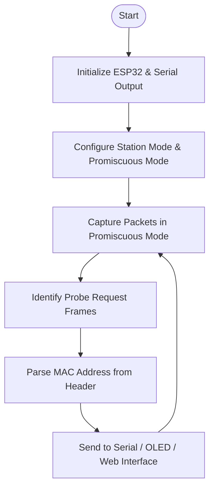

# ESP32-Based Wi-Fi Probe Sniffer for Ethical Penetration Testing

## Introduction

This project proposes the development of a compact, real-time Wi-Fi probe sniffer using the ESP32-Dev Module. Designed for educational and ethical penetration testing purposes, this tool passively captures and logs probe request packets to demonstrate the potential security vulnerabilities of Wi-Fi-enabled devices. It serves as an accessible, cost-effective entry point into wireless network security and embedded system design.

## Problem Domain

Wireless networks form the backbone of modern connectivity, enabling seamless communication in homes, businesses, academic institutions, and public spaces. However, the inherent openness of radio communication introduces serious security risks. The broadcast nature of Wi-Fi means that any nearby device can capture the signals, making it vulnerable to various forms of cyberattacks such as:

- **Eavesdropping**
- **Rogue access points**
- **Deauthentication attacks**
- **Man-in-the-middle (MITM) attacks**

These vulnerabilities often arise from configuration errors, reliance on deprecated protocols, or limited monitoring capabilities. While professionals rely on tools like Wireshark or specialized commercial hardware for packet analysis, such resources are often expensive, complex, and inaccessible to students and hobbyists.

### Challenges in Current Industry Practices

- High cost of commercial Wi-Fi monitoring tools and adapters
- Steep learning curve for open-source tools with limited embedded compatibility
- Lack of simple, self-contained systems for educational environments
- Demand for portable, field-deployable tools in ethical hacking scenarios

## Embedded Systems as a Viable Solution

The ESP32-Dev Module addresses these challenges with its built-in Wi-Fi capabilities, affordability, and robust developer ecosystem. One standout feature is **promiscuous mode**, which enables the ESP32 to receive all Wi-Fi packets on a channel regardless of their destination. This makes it possible to detect probe requests—packets sent by devices actively scanning for known Wi-Fi networks.

By leveraging this capability, we can build a functional Wi-Fi sniffer that logs probe requests, helping users understand the real-world implications of passive wireless data collection. This proof-of-concept is particularly relevant for ethical hackers, cybersecurity students, and researchers interested in IoT security.

## System Design Overview

### Key Hardware Components

- **ESP32-Dev Module**: The core microcontroller handling Wi-Fi sniffing and processing
- **USB Cable**: Provides power and enables communication for debugging and programming
- **OLED Display (Optional)**: Displays detected MAC addresses and device counts in real-time
- **Computer/Smartphone**: For viewing output via serial console or hosted web interface

### Communication Protocols

- **IEEE 802.11**: Captures Wi-Fi packets in monitor mode
- **UART**: Sends output to a PC via serial interface
- **HTTP (Optional)**: Hosts a basic web dashboard for real-time monitoring

### User Interface Options

- **Serial Terminal**: Basic output of MAC addresses and probe data
- **OLED Display (Optional)**: Live on-device feedback
- **Web Interface (Optional)**: Lightweight, ESP32-hosted page viewable on local networks

### System Block Diagram

```mermaid
graph TD
    A[Power Supply / USB] --> B[ESP32 Dev Module]
    B --> C[Wi-Fi Sniffing (Promiscuous Mode)]
    C --> D[Packet Filter: Probe Requests Only]
    D --> E[Extract Source MAC Address]
    E --> F[Serial Output / OLED / Web Interface]
```

### Flow Diagram



## Implementation Considerations

### Development Environment

- PlatformIO or Arduino IDE
- ESP32 Board Support Package (BSP)
- **Required Libraries**: 
  - `WiFi`
  - `Adafruit_SSD1306` (optional)
  - `ESPAsyncWebServer` (optional)

### Technical Requirements

- Promiscuous mode must be explicitly enabled using the ESP32 WiFi library
- A packet handler (callback) must parse 802.11 headers and filter for probe requests
- MAC addresses should be formatted and output via chosen interface (Serial, OLED, Web)

### Performance and Power

- Can be powered via USB or battery (low consumption)
- Real-time performance is sufficient for educational and light field use

## Ethical and Legal Notes

> **Important**: Captured packets are broadcast probe requests and do not involve decryption or active interference. Usage is aligned with ethical hacking guidelines and designed for passive, non-intrusive learning.

## Conclusion

This project presents a realistic, hands-on application of embedded systems in the realm of cybersecurity. The ESP32-based Wi-Fi probe sniffer offers:

- ✅ Insight into the hidden side of everyday wireless communication
- ✅ A low-cost, easy-to-build solution for education and demonstration purposes
- ✅ A stepping stone into the fields of wireless security, penetration testing, and ethical hacking

By empowering users to safely explore Wi-Fi vulnerabilities, this system encourages a deeper understanding of network security principles while reinforcing embedded development skills.

